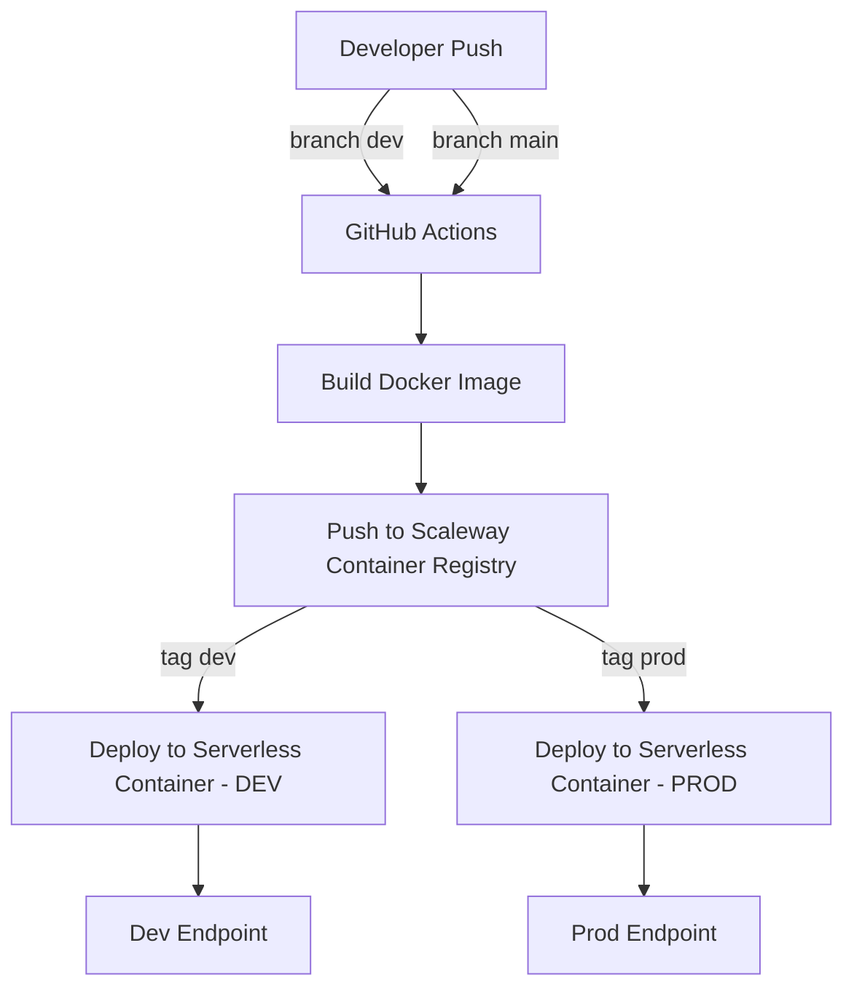

# Node.js + Scaleway (minimal)

Minimal sample that builds a Node.js “Hello World” container and pushes it to Scaleway Container Registry via GitHub Actions. You can then point one or more Serverless Containers at the pushed image tags.

## What’s included

- Hello World app (`server.js`) listening on `PORT` (defaults to `3000`).
- `Dockerfile` parameterized by `NODE_ENV` (dev/prod).
- CI workflow that builds, pushes and deploys on `dev` and `main` branches:
  - `dev` branch → image tag `dev` → deploy to your dev container
  - `main` branch → image tag `prod` → deploy to your prod container

## Prerequisites

- Scaleway account with Access Key and Secret Key.
- A Container Registry namespace (see Scaleway Console → Container Registry).
- GitHub repository with these secrets set:
  - `SCW_ACCESS_KEY`
  - `SCW_SECRET_KEY`
  - `SCW_REGISTRY_NAMESPACE` (format: `rg.<region>.scw.cloud/<namespace>` or your custom domain + namespace)
  - `SCW_REGION` (e.g. `fr-par`)
  - `SCW_DEFAULT_ORGANIZATION_ID`
  - `SCW_DEFAULT_PROJECT_ID`
  - `SCW_CONTAINER_DEV_NAME` (e.g. `myapp-dev`)
  - `SCW_CONTAINER_PROD_NAME` (e.g. `myapp-prod`)

Example secrets file: `examples/github-secrets.example.env`.

## Deploy with GitHub Actions

1. Fork or clone this repo and set the three secrets above.
2. Push to `dev` (or `main`). The workflow in `.github/workflows/deploy.yml` will:
   - Log in to your Scaleway registry
   - Build the Docker image (with `NODE_ENV=development` on `dev`, `production` on `main`)
   - Push tags: `dev|prod` and the commit SHA
   - Deploy the corresponding image to your Serverless Container (`SCW_CONTAINER_DEV_NAME` or `SCW_CONTAINER_PROD_NAME`)

## Connect a Serverless Container

You can let the workflow create/update them automatically via `scw serverless container deploy`. Or create them once in the Scaleway Console and let CI update the image:
- Image: `SCW_REGISTRY_NAMESPACE/hello-world:dev` (or `:prod`)
- Port: `3000`
- Min/Max scale: choose what fits your needs
- Optional: attach a domain to each container

## Run locally

- `npm start` → http://localhost:3000 returns “Hello World”.

## Diagram

That’s it — simple app, simple pipeline with two environments. Adjust names and scaling as you grow.
